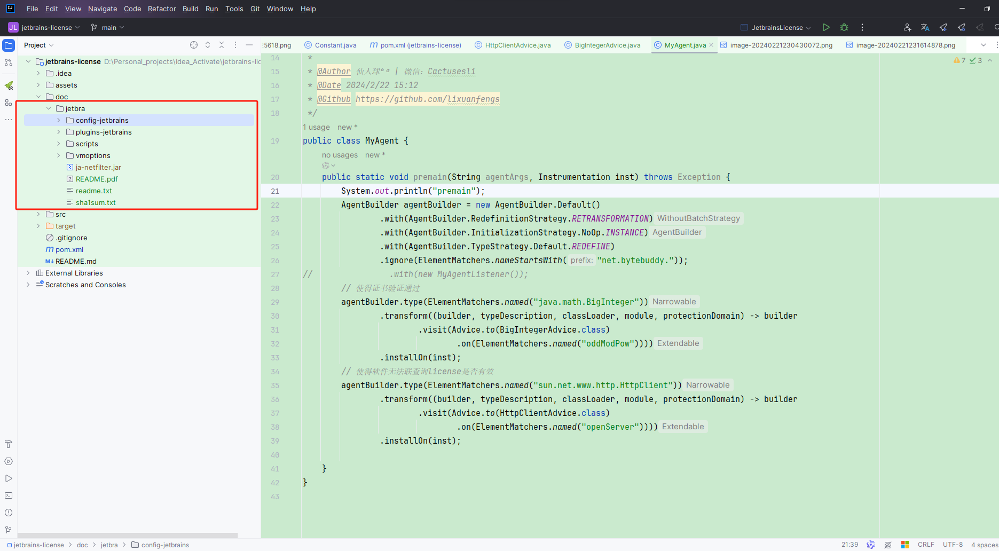
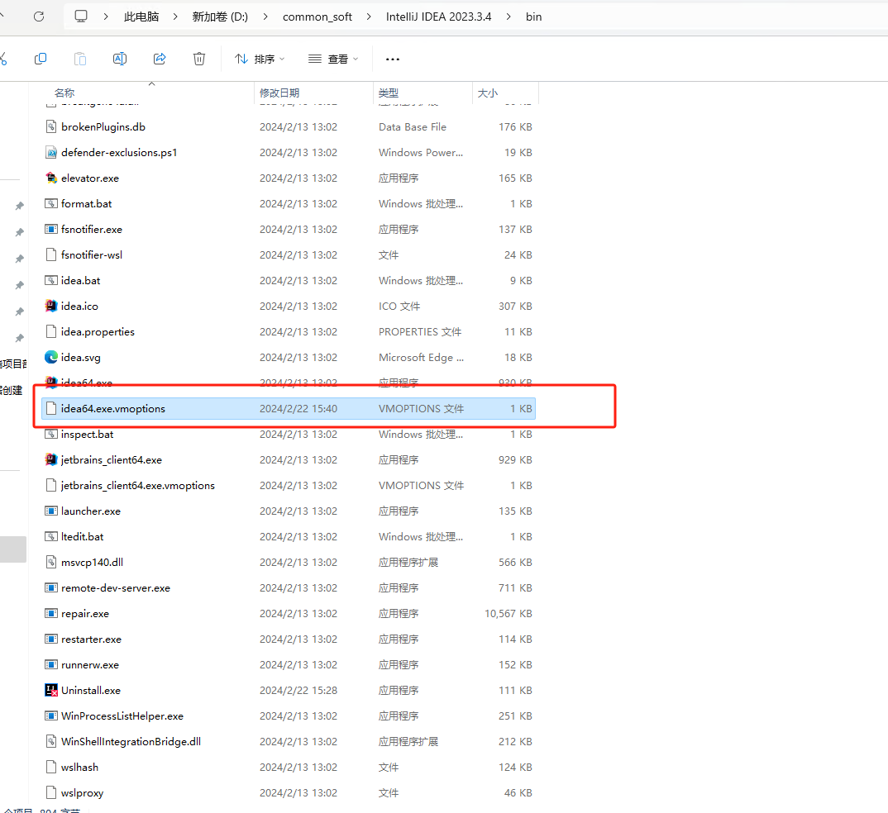
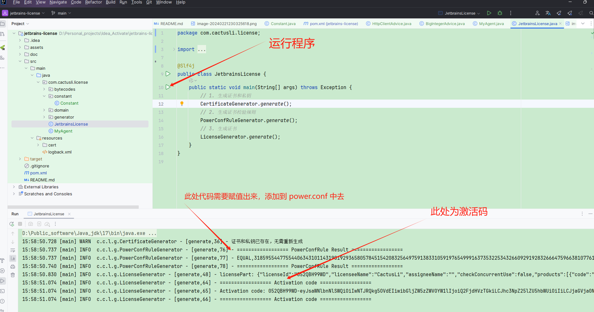
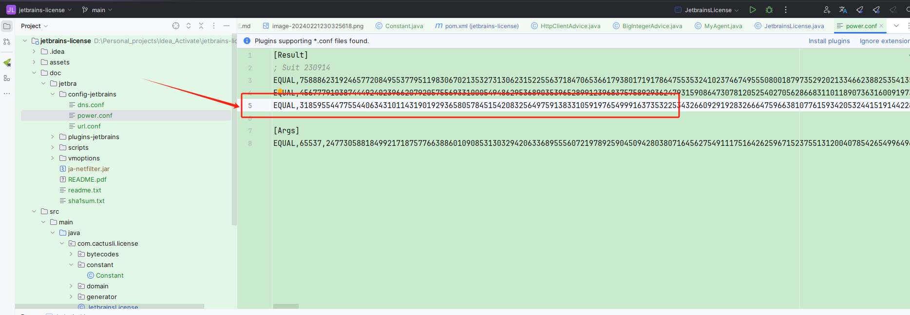
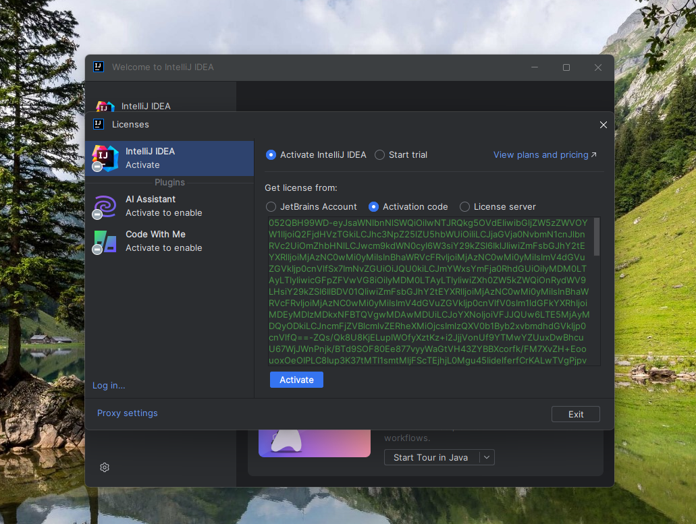

# **以下仅供学习交流使用，禁止其它用途!!!**

# **以下仅供学习交流使用，禁止其它用途!!!**

# 使用方法

第一种激活方式

找到项目中 doc 下的jetbra



然后在找到你本地 `idea` 的安装目录，比如：D:\common_soft\IntelliJ IDEA 2023.3.4\bin

再找到 `idea64.exe.vmoptions`



在文件中添加如下参数：

```java
--add-opens=java.base/jdk.internal.org.objectweb.asm=ALL-UNNAMED
--add-opens=java.base/jdk.internal.org.objectweb.asm.tree=ALL-UNNAMED
// 此路径对应项目中 doc 下的 jetbra（图中是我本地的路径）
-javaagent:C:\Users\admin\Desktop\jetbra-ded4f9dc4fcb60294b21669dafa90330f2713ce4\jetbra\ja-netfilter.jar=jetbrains
```


修改该项目中的常量信息，选择需要激活的软件


运行主程序生成激活码





运行需要破解的软件，输入生成的激活码

```shell
052QBH99WD-eyJsaWNlbnNlSWQiOiIwNTJRQkg5OVdEIiwibGljZW5zZWVOYW1lIjoiQ2FjdHVzTGkiLCJhc3NpZ25lZU5hbWUiOiIiLCJjaGVja0NvbmN1cnJlbnRVc2UiOmZhbHNlLCJwcm9kdWN0cyI6W3siY29kZSI6IklJIiwiZmFsbGJhY2tEYXRlIjoiMjAzNC0wMi0yMiIsInBhaWRVcFRvIjoiMjAzNC0wMi0yMiIsImV4dGVuZGVkIjp0cnVlfSx7ImNvZGUiOiJQU0kiLCJmYWxsYmFja0RhdGUiOiIyMDM0LTAyLTIyIiwicGFpZFVwVG8iOiIyMDM0LTAyLTIyIiwiZXh0ZW5kZWQiOnRydWV9LHsiY29kZSI6IlBDV01QIiwiZmFsbGJhY2tEYXRlIjoiMjAzNC0wMi0yMiIsInBhaWRVcFRvIjoiMjAzNC0wMi0yMiIsImV4dGVuZGVkIjp0cnVlfV0sIm1ldGFkYXRhIjoiMDEyMDIzMDkxNFBTQVgwMDAwMDUiLCJoYXNoIjoiVFJJQUw6LTE5MjAyMDQyODkiLCJncmFjZVBlcmlvZERheXMiOjcsImlzQXV0b1Byb2xvbmdhdGVkIjp0cnVlfQ==-ZQs/Qk8U8KjELupIWOfyXztKz+i2JjjVonUf9YTMwYZUuxDwBhcuU67WjJWnPnjk/BTd9SOF80Ee877vyyWaGtVH43ZYBBXcorfk/FM7XvZH+EoouoxOeOIPLC8Iup3K37tMTI1smtMljFScTEjhjL0Mgu45IidelferfCrKALwTVgPjpvSVnBmnhlrexpg5JpCIX3XXzTgUNq8IUyxtGQnPVO88+Lp2u4tftiqPMN8A+bJVNWGqTDfqUpKrpMyHnjJIFk4rKUpI5AXWlUnH8zpSEszRUILKGX2SLaGBfhkAni3jwSdAsRK3OVEgyR4WO7MbPwMfWHUZgVa//zWKnUJFCwxOuDXTMWXaL/SA7aT8Qqgz/K8L6k0fGQG4KZ/mRqULXyRIisObcyszekmvy61zXXCUGKsc2h3TueD8Ygu24EQKMoYlBP9XI7dpvP7k6UDLZZ9WClWy97XuwD0wFIeSvb2WwVfZh65Ff4xNqOfhpKIzh2NHg9tar6lNI7jd/0MaVaPQqqJCq1r6liBKfkm88hsRzQqcnLxOrEYDMgWbBOm4RsLErvQc7jD7HcrC5aOha0IGhIqT4JFXQopalrtBJXPI17Ht9ViAhYwVSnWQQXWeTsXMHQ0dHIlq2cM8wnCowf+9VJhmcdjSnl+gS/8HEObN+46hXzaN0aWMh10=-MIIEtzCCAp+gAwIBAgIGAY3LhdyVMA0GCSqGSIb3DQEBCwUAMBgxFjAUBgNVBAMMDUpldFByb2ZpbGUgQ0EwHhcNMjQwMjE5MTYwMDAwWhcNMzQwMjIwMTYwMDAwWjAhMR8wHQYDVQQDDBZOb3ZpY2UtZnJvbS0yMDI0LTAxLTE5MIICIjANBgkqhkiG9w0BAQEFAAOCAg8AMIICCgKCAgEAv+rbcmaARfrEGHIbKOIi5f/eDFE+IEAmVQRO0D3Ha3k9q685CRQk5faMZUc04j2g49tASgMkgZDf6iCYkMTlTXWhf+FOYFSoII5Pykbbu6NaZ3uiReQ/mxUbj98R7BuD4ZlkgzspJdnfJMpLIV0yJIbVsG4MzOtMdfdETDO3zWJooCR5uPZb/XX6sCmOB0V3KVLy+TVv9csalRWUdqNfFhvpVUcvkBZcT3itkg2mJtZ9JJ2HLyl7NTTLv0o3Z+9gS7QzM9wv3snBdC0hA+6woG+qbsxJiEUhfPq9L34Zdr1WqyiyejL7OdOs7rf6o7/P8WqK2sAn6A+hL8vYGAsziXPGTwATXIi8ZH29Dja42GIAnwz6rl32ZW67QrGUBoqUZHToScr8vPR1kmVc/P0bcfEv2WR+OP9QsklBtuuMA2KVtEDGSMQHNUpnFykH3vwv7iJ26xd7nH7B1B58pKN8QFIhcXFRgPG87zz+zg6xOJ0N9hnjk9BUwzaq/TUiLQubINKjclUAZEqzWJAUPLvJjglBtGJumLdc1WtnHSpPdzYrhlXpI7vY9ShnG/j1sNoxIyDuEdVt5EkiSIHCS4rNM5x6U0xYCpvc1qIOrKDCRQKiItVEt1sFnqVX7GYrez4FFWm0oMcBHCxXY6aAgc+F6Zd1knGx2Eywq7+S9pV6srsCAwEAATANBgkqhkiG9w0BAQsFAAOCAgEAThgNgeH6mMa8J/Fqu7gHA07ZtvNOCHezlgQhIyVEkEKBVLaQx4eJC4Fq1UQeKyX8558Eo5raNLpAdOi29/beRERnNsRd13HeajcHPHLOr9hVA2pLUIyxooWkuMPCUV8BaaH05ToSYhxQ3lPLxb3PvDvKFkxoLgMRbb9D/kFAMFjBIX11qWlXMnoP69y4Tk28SJMaqE1zssfqGJfgSSKP5mZwrGmsBHRYbLgWTgCqAuH/US3Uajol68CTBHIIbpHFbAc99w+D2YzanyF5aiHTqkGZnkNMKZPZdmkPc6Z0TOfpwd5lTYkBp12tePP9jFS+wL5i4Qa/Y9QOxXxLWFLIopCYWWFu7ePTUhCmKWDk1H/Ok2c4twOlCvTNDFrIPw6jVaGu67kefw109A7a4nvt2eMr/ol/ECMV1eG92i4Oi5GPV3Tge6GBbVsXIe6C+NCKCocpI3gxEjW60JkwmXId3CO3zm1JdvscBF8TTfuPUvLakSdlh4J5753iW7p3y8/a8zxaDutk/dz5bbWXUTCZUrY5pUYEzPM6eecjnRj6myvaODqobI2eXoptibkto3WfqfS01q8xwSDguluhkL+tUz49RMv7z3PjHt4WD+qHQvJxUimCClDGFEwj1k+OV5S2fpFUdjiK1Xx0PNfMsWcDdeWj1Gp06brgdglQnN29SfI=
```



第一种激活方式至此激活成功。

第二种激活方式

使用 maven 打包命令，把项目打成 jar 包

```shell
mvn clean package '-Dmaven.test.skip=true'
```

